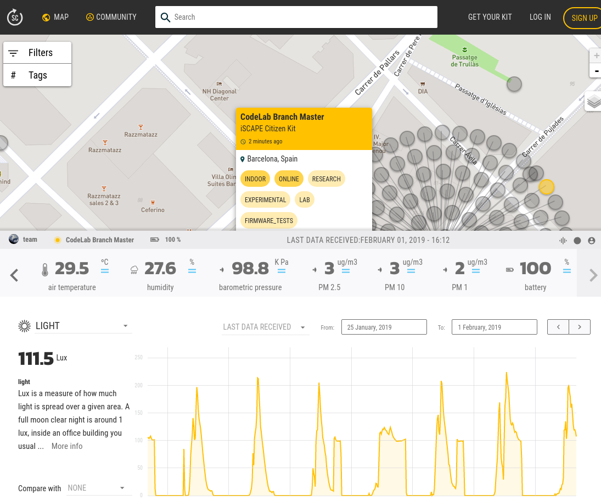

# SmartCitizen Web 

[](https://travis-ci.org/fablabbcn/smartcitizen-web)
[](https://codeclimate.com/github/fablabbcn/smartcitizen-web/maintainability)
[](https://codeclimate.com/github/fablabbcn/smartcitizen-web/test_coverage)
[](https://doi.org/10.5281/zenodo.2566531)
[]()

The SmartCitizen [front-end](https://kits.smartcitizen.me/). Working together with the new [SmartCitizen API](https://github.com/fablabbcn/smartcitizen-api).



## Development

### Prerequisites

You need git to clone the repository. You can get git from
[http://git-scm.com/](http://git-scm.com/).

We also use a number of node.js tools to initialize and test the Web App. You must have node.js and
its package manager (npm) installed. You can get them from [http://nodejs.org/](http://nodejs.org/).

Also gulp: `npm install -g gulp` (with `sudo` if you are using Mac).

### Clone the project

Clone the repository using:

```
git clone https://github.com/fablabbcn/smartcitizen-web.git
cd smartcitizen-web
```

### Docker quickstart (optional)
If you want to use Docker in development mode, you should enable the `volume:` in docker-compose.yml so you won't need to rebuild after every file change.
This also means the image needs you to do `npm install` **locally** before running the container.
It needs the `node_modules/` to exist.

`docker-compose up`

### Install dependencies
* Install tools to manage and test the application: `npm install.`
* No need of `bower install`, `npm install` will take care of it.

### Use Gulp tasks

* `gulp` or `gulp build` to build an optimized version of your application in `/dist`
* `npm run dev` (or `gulp serve`) to launch a browser sync server on your source files
* `gulp serve:dist` to launch a server on your optimized application
* `gulp test` to launch your unit tests with Karma
* `gulp test:auto` to launch your unit tests with Karma in watch mode
* `gulp protractor` to launch your e2e tests with Protractor. Tests are in the ./e2e/ folder.
* `gulp protractor:dist` to launch your e2e tests with Protractor on the dist files
* `npm run deploy` to publish the project to Github pages (gh-pages branch).

Note: in case you see something like:
> Error: Command failed: fatal: unable to read c6a8d370f3e95d9110eca4a03b704bd8940ca40b

Run:
`rm -Rf $(node -e "console.log(require('path').join(require('os').tmpdir(), 'tmpRepo'))")`

### Talking to a different API
In `app.route.js` the app can be configured to talk to another API:
`RestangularProvider.setBaseUrl('http://localhost:3000/v0');`

### Directory structure

[Best Practice Recommendations for Angular App Structure](https://docs.google.com/document/d/1XXMvReO8-Awi1EZXAXS4PzDzdNvV6pGcuaF4Q9821Es/pub)

### Git Commit Guidelines
Visit https://github.com/ajoslin/conventional-changelog/blob/master/CONVENTIONS.md


### Naming conventions for files
Same for all types of components:
<Name of component camelcased>.<Type of module>.js
Ex: kit.controller.js, sensor.service.js, profileTools.constant.js


### Naming conventions for components
Controller: <Name of controller capitalized>Controller. Ex: MapController
Service: <Name of service camelcased>. Ex: device, kit, user
Constructor: <Name of constructor capitalized>. Ex: User, Kit. Note: Constructors are actually made using services.
Constants: <Name of constant uppercase joined by an underscore>. Ex: PROFILE_TOOLS

For data that has been resolved from the router, I've normally appended 'Data' to the name.

## Deployment

Master branch is auto deployed to https://staging.kits.smartcitizen.me/ which is on Github Pages

* **Staging:** Change base tag on index.html to `base` url for staging: http://fablabbcn.github.io/smartcitizen-web/ and do `gulp deploy`.
* **Production:** Change base tag back to `/`. Do `cap production deploy` and select the branch you want to deploy.

Deploy a custom commit with example:

`cap production deploy REVISION=522d974`

## Funding

This work has received funding from the European Union's Horizon 2020 research and innovation program under the grant agreement [No. 689954](https://cordis.europa.eu/project/rcn/202639_en.html)
